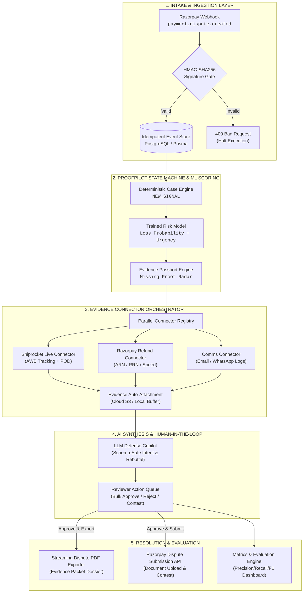

# ProofPilot-AI | Automated Dispute Resolution & Evidence Orchestration Engine for Razorpay

> **Turning dispute defense from hours of manual labor into a 1-click submission packet.**

[](https://razorpay.com)
[](https://nodejs.org)
[](https://expressjs.com)
[](https://react.dev)
[](https://razorpay.com/docs/api/)
[](https://www.shiprocket.in/)
[](https://prisma.io)
[](LICENSE)

---

###  Quick Links & Pitch Video
| Resource | Link |
| :--- | :--- |
| 🌐 **Live Demo Application** | https://proofpilot-ai.onrender.com/ |
| 🎥 **5-Minute Video Walkthrough** | [Watch Video on Google Drive](https://drive.google.com/drive/u/0/folders/1jLkM1ABBKEesqdNAS1Q9v3vjmoG64DiF) |
| 📊 **Reliability & Metrics Export** | `GET /api/reliability/export` |

---

## 1. Executive Summary & Business Signal

### The Core Problem
E-commerce merchants lose **1.5% to 3.2% of gross merchant volume (GMV)** annually to preventable chargeback disputes. When payment gateways issue dispute notifications, merchants face strict **24–48 hour submission SLAs**. Evidence collection is fractured across disjointed systems:
- Logistics tracking & Proof of Delivery (POD) live in couriers like **Shiprocket** / **Delhivery**.
- Transaction logs & refund status live in **Razorpay**.
- Customer communications are buried in **Email** / **WhatsApp**.

Missing evidence or missed deadlines causes automatic forfeiture of funds, gateway dispute fees, and potential merchant account blacklisting.

### Our Solution
**ProofPilot-AI** is an autonomous dispute operations engine and merchant risk co-pilot built on Razorpay APIs. It connects real-time intake webhooks directly to logistics carriers, refund histories, and LLM reasoning pipelines:
1. **Instant Webhook Ingestion & Idempotency:** Zero-loss capture of Razorpay dispute events with HMAC-SHA256 signature verification.
2. **Autonomous Evidence Gathering:** Real-time connectors query courier APIs (Shiprocket) for digital Proof of Delivery and AWB tracking snapshots, and query Razorpay for prior refunds and ARN/RRN codes.
3. **Guardrailed AI Defense Drafting:** Synthesizes dispute intent, checks against required evidence schemes, and generates compliant rebuttal narratives.
4. **1-Click Submission & PDF Dossier:** Assembles a tamper-evident, multi-page dispute defense PDF packet and offers bulk human-in-the-loop operational actions.

```
┌─────────────────────────────────────────────────────────────────────────────┐
│                            KEY BUSINESS ROI METRICS                         │
├──────────────────────────────┬──────────────────────────────┬───────────────┤
│ 40–60% Evidence Auto-Filled  │      0 Missed Deadlines      │ Up to 40% Ops │
│ via Multi-System Connectors  │   SLA Risk Scoring & Alerts  │  Time Savings │
└──────────────────────────────┴──────────────────────────────┴───────────────┘
```

---

## 2. System Architecture & Data Flow



### Deterministic State Machine Lifecycle
```text
NEW_SIGNAL ──► NEEDS_PROOF ──► PROOF_READY ──► DRAFT_READY ──► AWAITING_APPROVAL ──► APPROVED_TO_CONTEST ──► CONTESTED / CLOSED
```
Every case transition is cryptographically audited and blocked from external Razorpay submission until human approval and strict evidence readiness thresholds ($\ge 80\%$) are satisfied.

---

## 3. Feature Breakdown (Code-Mapped)

###  1. Shiprocket & Logistics Tracking Connector
- **Implementation:** [`server/connectors/shiprocketConnector.js`](file:///server/connectors/shiprocketConnector.js), [`server/connectors/connectorRegistry.js`](file:///server/connectors/connectorRegistry.js)
- **Mechanism:** Interrogates Shiprocket APIs using order references, fetches real-time AWB tracking status, and auto-attaches digital delivery proof timestamps to resolve `goods_not_received` claims immediately without manual courier portal searches.
- **Fail-Safe Isolation:** Connectors execute in parallel via `Promise.allSettled()`; third-party courier latency or downtime never degrades core webhook ingestion.

###  2. Razorpay-Compliant PDF Exporter
- **Implementation:** [`server/services/pdfExportService.js`](file:///server/services/pdfExportService.js), [`POST /api/cases/:id/export-pdf`](file:///server/index.js)
- **Mechanism:** Builds a formal, server-side streaming PDF packet containing:
  - Header & Case Summary with claim IDs, transaction hashes, and merchant details.
  - Complete chronological Audit Trail (timestamps, actors, review actions).
  - Razorpay-mapped evidence schedule (Invoices, POD, customer chat transcripts, refund ARNs).
  - Clean vector formatting and page-budget management.

###  3. Bulk Operations & High-Velocity Ops UI
- **Implementation:** [`server/index.js (validateBulkActionBody)`](file:///server/index.js), [`src/components/dashboard/RiskQueue.jsx`](file:///src/components/dashboard/RiskQueue.jsx)
- **Mechanism:** Enables risk analysts to execute batch operations (`approve`, `reject`, `archive`, `assign`) across multi-selected disputes in atomic database transactions (`db.$transaction`).
- **Safety Guarantee:** Prevents bulk approval if any selected case fails required evidence validation.

###  4. SLA Deadline Alerts & Risk Evaluation System
- **Implementation:** [`server/services/metricsService.js`](file:///server/services/metricsService.js), [`src/lib/mlRiskModel.js`](file:///src/lib/mlRiskModel.js), [`scripts/train-risk-model.js`](file:///scripts/train-risk-model.js)
- **Mechanism:** Evaluates disputes using an 8-feature loss risk regression model ($F_1 = 0.898$, Recall $= 95.7\%$, Precision $= 84.7\%$). These figures are evaluated on a synthetic held-out split and would need re-validation on real production data.
- **Calculated Backend Metrics:** Calculates `money_at_risk`, `recoverable_value`, `net_merchant_benefit`, and `false_positive_review_cost` server-side with zero client-side calculation drift.

---

## 4. Repository Code Map

```text
ProofPilot-AI/
├── prisma/
│   ├── schema.prisma                  # PostgreSQL schema: Merchant, Case, EvidenceItem, TimelineEvent, AuditLog
│   └── seed.js                        # Idempotent demo and baseline dispute records
├── scripts/
│   ├── dev-local.js                   # Unified concurrent dev runner (Vite UI + Express API)
│   ├── train-risk-model.js            # ML Logistic Regression model trainer & holdout evaluator
│   └── backfill-merchant-ownership.js # Migration script for multi-tenant merchant isolation
├── server/
│   ├── connectors/                    # Multi-source auto-evidence gathering layer
│   │   ├── connectorRegistry.js       # Parallel execution registry & aggregator
│   │   ├── razorpayRefundConnector.js # Live Razorpay refund, ARN & speed-processed fetcher
│   │   ├── shiprocketConnector.js     # Shiprocket delivery status & AWB proof connector
│   │   └── emailSummaryConnector.js   # Customer communication & support ticket extractor
│   ├── integrations/
│   │   └── razorpayClient.js          # Direct Razorpay API client (Disputes, Payments, Docs)
│   ├── middleware/
│   │   └── auth.js                    # JWT/OIDC authentication & token bucket rate limiter
│   ├── ml/
│   │   ├── promptBuilder.js           # Structured prompt construction for defense drafts
│   │   ├── schemaValidator.js         # JSON schema guardrails for AI output parsing
│   │   └── classifier.js              # Intent & category heuristic extractors
│   ├── queue/
│   │   ├── queueClient.js             # BullMQ / Redis background job client & health checker
│   │   └── workers.js                 # Asynchronous background retries & worker listeners
│   ├── routes/
│   │   ├── architecture.js            # Endpoints detailing system topology & AI boundaries
│   │   ├── cases.js                   # REST controllers for dispute case operations
│   │   ├── metrics.js                 # Real-time financial exposure & ROI metrics
│   │   └── webhooks.js                # Signed incoming webhook receivers
│   ├── services/
│   │   ├── pdfExportService.js        # Server-side streaming dispute PDF packet generator
│   │   ├── evidenceService.js         # Multi-backend evidence storage (S3 + Local Disk)
│   │   ├── riskScoringService.js      # Hybrid ML + deterministic risk & readiness scoring
│   │   ├── webhookIdempotencyService.js# SHA-256 payload hashing & replay deduplication
│   │   ├── decisionService.js         # Approval validation & evidence completeness gates
│   │   └── metricsService.js          # Financial impact, time saved & model confusion metrics
│   └── index.js                       # Primary Express application, routing & error interceptors
├── src/                               # React 18 + Tailwind CSS Frontend
│   ├── components/
│   │   └── dashboard/                 # EvidencePassport, MissingProofRadar, RiskQueue, SafetyPanel
│   ├── lib/                           # Shared rule engine, AI guardrails, and sample datasets
│   ├── model/                         # Exported trained ML model weights and metadata
│   └── pages/                         # Dashboard & Authentication views
└── tests/
    └── proofpilot.integration.test.js # End-to-end integration test suite
```

---

## 5. Local Setup & Quickstart Guide

### Prerequisites
- **Node.js**: `v18.0.0` or higher
- **npm**: `v9.0.0` or higher
- **PostgreSQL** *(optional for local mode; uses in-memory/sample data fallback by default)*

### Installation & Execution

```bash
# 1. Clone the repository
git clone https://github.com/Pranay207/ProofPilot-AI.git
cd ProofPilot-AI

# 2. Install all dependencies and generate Prisma client
npm install

# 3. Configure environment variables
cp .env.example .env

# 4. Start both Vite Frontend (Port 5173) and Express API (Port 4000)
npm run dev
```

Visit the dashboard in your browser: **`http://localhost:5173`**  
Direct API access: **`http://localhost:4000`**

### Running Automated Test Suite
```bash
npm test
```
*Validates webhook signatures, duplicate prevention, AI JSON guardrails, fallback behavior, evidence attachments, and PDF stream generation.*

---

## 6. API Reference Documentation

| Method | Endpoint | Description | Auth Required |
| :--- | :--- | :--- | :---: |
| `POST` | `/api/webhooks/razorpay` | Ingests signed Razorpay webhooks (`x-razorpay-signature`) | Signature |
| `GET` | `/api/cases` | Lists all disputes filtered by merchant and loss risk | Yes |
| `POST` | `/api/cases` | Manually creates a new dispute case for risk evaluation | Yes |
| `PATCH` | `/api/cases/:id/evidence` | Attaches a binary or base64 evidence file to a case | Yes |
| `DELETE`| `/api/cases/:id/evidence/:key` | Detaches an evidence item and recalculates readiness | Yes |
| `POST` | `/api/cases/:id/auto-collect-evidence` | Triggers Shiprocket & Razorpay evidence auto-collection | Yes |
| `POST` | `/api/cases/bulk-action` | Executes atomic batch actions (`approve`, `reject`, `assign`) | Yes |
| `POST` | `/api/cases/:id/export-pdf` | Generates and downloads the formal Razorpay dispute packet PDF | Yes |
| `POST` | `/api/cases/:id/submit` | Submits the approved contest packet to Razorpay Dispute API | Yes |
| `GET` | `/api/metrics` | Returns live exposure, recoverable value, and time savings | Yes |
| `GET` | `/api/reliability` | System health checks (webhook gate, S3 storage, AI fallbacks) | No |
| `GET` | `/api/reliability/export` | Machine-readable architecture & evaluation export for evaluators | No |

---

## 7. Architecture Pattern: Propose–Verify–Approve (PVA)


```bash
# ✅ PROPOSE (AI Advisory Layer)
# • Parse unstructured customer claims and complaints.
# • Extract critical metadata (dates, order tokens, promised refund amounts).
# • Auto-draft professional, rule-compliant dispute response letters for human review.
# • Surface risk reasons and missing evidence cues to operators.

# 🛡️ VERIFY (Deterministic Policy Engine)
# • Validate evidence checklist completeness against hard thresholds (minimum 80% readiness required).
# • Enforce cryptographic webhook verification (HMAC-SHA256) and replay deduplication.
# • Verify schema safety and JSON structure before enabling submission paths.

# ❌ APPROVE (Gated Execution & Prohibitions)
# • AI is strictly prohibited from triggering dispute submissions to Razorpay without human approval.
# • AI cannot initiate or mutate financial refunds or ledger entries.
# • AI cannot bypass deterministic checklist rules or cryptographic checks.

```

---

<div align="center">
  <i>Engineered for Reliability, Financial Accuracy, and Zero Disputed Value Loss.</i>
</div>
